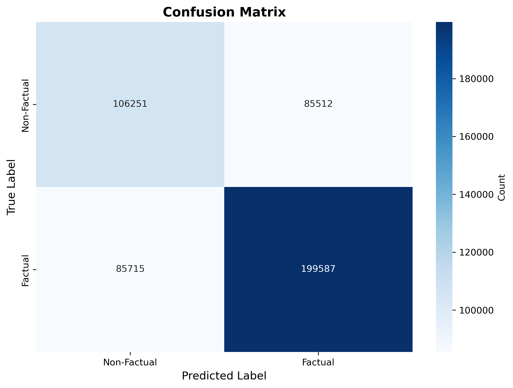
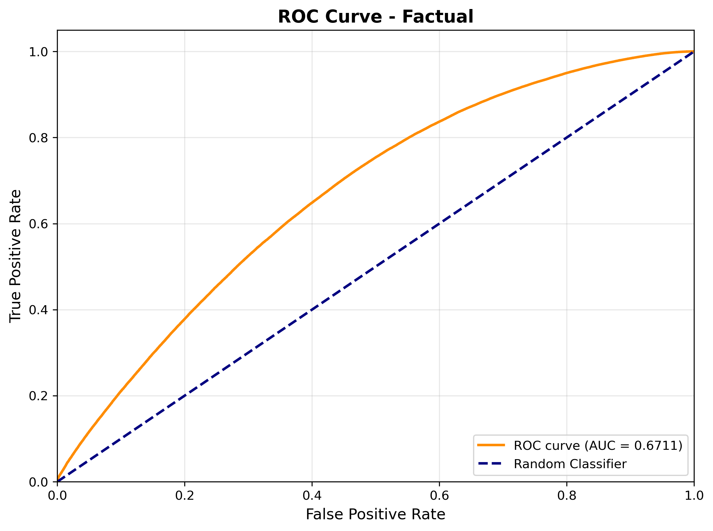

# Logistic Regression Baseline Results

## Overview

We trained a TF-IDF + Logistic Regression baseline model on 3,193,625 Reddit posts from the FACTOID dataset to establish a performance benchmark for factuality detection. The model was trained using TF-IDF vectors with up to 50,000 features (unigrams and bigrams), L2-regularized logistic regression with balanced class weights, and a stratified 70-15-15 train-validation-test split. Training completed in approximately 21 minutes on CPU, demonstrating the computational efficiency of this traditional machine learning approach.

## Performance Analysis

The model achieved an overall accuracy of 64.11% on the test set of 477,065 posts, with a macro F1 score of 0.627 and ROC-AUC of 0.671. These results establish a solid baseline for comparison with more sophisticated transformer-based models. Notably, the model performed better at identifying factual content (70.0% F1-score) compared to non-factual content (55.4% F1-score), likely reflecting both the class imbalance in the dataset (60% factual vs. 40% non-factual) and the inherent difficulty in detecting misinformation through lexical features alone.

### Confusion Matrix



The confusion matrix reveals that the model correctly classified 106,251 non-factual posts and 199,587 factual posts, while misclassifying 85,512 non-factual posts as factual and 85,715 factual posts as non-factual. The relatively balanced error rates across classes (44.6% error for non-factual vs. 30.0% error for factual) suggest the model isn't simply learning to predict the majority class, though it does show a bias toward predicting factual content.

### ROC Curve Analysis



The ROC curve demonstrates an AUC of 0.671, indicating moderate discriminative ability between factual and non-factual content. While significantly better than random chance (0.5), this leaves substantial room for improvement through more sophisticated modeling approaches. The curve's shape suggests the model maintains reasonable performance across various classification thresholds, providing flexibility for applications that require different precision-recall trade-offs.

## What the Model Learned

Analysis of the model's feature coefficients reveals interesting patterns about what linguistic cues the algorithm associated with factuality. The model strongly associated inflammatory and politically charged language with non-factual content, particularly terms related to climate denial ("alarmists" with coefficient -7.88, "agw" -4.96, "climate" -4.21) and divisive political rhetoric ("leader donnie" -7.22, "orange monster" -7.10). Conversely, the model learned to associate technical terminology and specific references with factual content, including vaccine-related discussions ("novavax" 4.28, "anti vax" 4.26) and technical references ("github new" 4.13).

This pattern suggests the model is learning to distinguish between emotional, opinion-based language and more neutral, reference-based discourse. However, this raises important concerns about whether the model is truly identifying factuality or merely learning to recognize stylistic differences between different types of Reddit communities. The strong topic-specific associations (climate change, politics, vaccines) indicate the model may struggle to generalize beyond the specific domains present in the training data.

## Limitations and Insights

The TF-IDF approach, while computationally efficient and interpretable, operates at a surface level that cannot capture semantic meaning or contextual nuances. The model treats text as a "bag of words," ignoring word order beyond bigrams and failing to understand how context changes meaning. For example, "vaccine is effective" and "vaccine is not effective" would have similar TF-IDF representations despite opposite meanings. This limitation is particularly problematic for factuality detection, where subtle linguistic cues and logical relationships are crucial.

Additionally, the model appears to have learned strong associations between writing style and factuality labels, which may not reflect true factual accuracy. Inflammatory language doesn't necessarily indicate non-factual content, just as technical jargon doesn't guarantee factuality. The model's heavy reliance on topic-specific terms (climate change skepticism terminology, political nicknames) suggests it may be learning correlations specific to the Reddit communities in the training data rather than generalizable patterns of factual vs. non-factual discourse.

## Implications for Future Work

These baseline results establish that simple lexical features can capture some patterns of factuality in Reddit posts, achieving 64% accuracy through word frequencies alone. However, the limitations identified here motivate the development of more sophisticated approaches. The upcoming DistilBERT transformer model should address many of these shortcomings by understanding semantic context, capturing long-range dependencies, and learning more abstract representations of factuality beyond surface-level lexical patterns.

The model's tendency to associate specific topics with factuality labels also highlights the importance of external validation. By comparing model predictions against professionally curated Reuters news articles, we can assess whether the model has learned genuine factuality indicators or merely topic-specific and stylistic associations. This analysis will be crucial for understanding the model's potential for real-world deployment, where it must handle diverse topics and writing styles not seen during training.

## Reproducibility

All results can be reproduced using the following command:

```bash
python -m src.train_logreg \
    --factoid_path data/factoid_clean.csv \
    --output_dir results/logreg_full \
    --max_features 50000 \
    --ngram_range 1 2 \
    --random_seed 42
```

Additional files in this directory include the trained model (`logreg_model.pkl`, 391KB), TF-IDF vectorizer (`tfidf_vectorizer.pkl`, 1.7MB), detailed metrics (`test_metrics.json`), classification report (`classification_report.txt`), top features analysis (`top_features.csv`), and complete test predictions (`test_predictions.csv`, 24MB with 477,065 rows).
